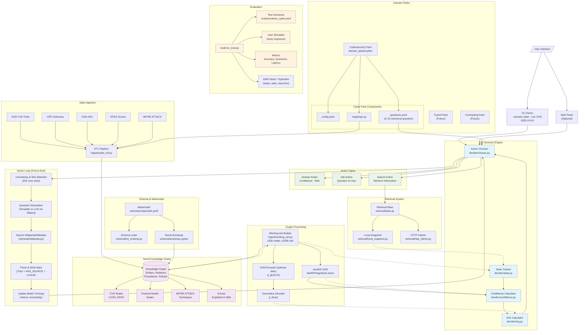

# VEGETA System Architecture

This document provides a visual overview of the Value Estimation Gain Evaluation Tool & Analysis (VEGETA) system architecture.

## System Architecture Diagram

## Key Components

### Core Decision Engine
- **State Tracker**: Maintains current knowledge state and evidence
- **Confidence Calculator**: Computes confidence scores for potential answers
- **EIG Calculator**: Calculates Expected Information Gain for each action
- **Action Chooser**: Selects optimal action (Answer/Ask/Search) based on EIG and costs

### Graph Processing
- **Working Set Builder**: Creates bounded subgraphs for processing
- **GNN Encoder**: Neural network encoder for graph representations
- **Generative Decoder**: Predicts observations from latent states

### Knowledge Graph (Neo4j)
- **Entities**: CVEs, Products, Vendors, Techniques
- **Relations**: Whitelisted predicates (IS_A, AFFECTS, MITIGATES, etc.)
- **Procedures**: Workflow steps and decision branches
- **Policies**: Cost models and risk assessments

### Domain Packs
- **Cybersecurity Pack**: CVE triage and vulnerability assessment
- **Future Packs**: Public Transit, Open Contracting (planned)
- **Components**: Configuration, mappings, canonical questions

### Data Sources
- **NVD**: National Vulnerability Database CVE feed
- **CPE**: Common Platform Enumeration dictionary
- **CISA KEV**: Known Exploited Vulnerabilities catalog
- **EPSS**: Exploit Prediction Scoring System
- **MITRE ATT&CK**: Tactics, techniques, and procedures

### Evaluation Framework
- **Test Scenarios**: Ground-truth datasets for validation
- **User Simulator**: Automated testing with realistic user responses
- **Metrics**: Accuracy, efficiency, and performance measurements

## Data Flow

1. **Ingestion**: External feeds → ETL → Knowledge Graph
2. **Working Set**: Task context → Bounded subgraph extraction
3. **Encoding**: Graph + Evidence → Neural representations
4. **Decision**: EIG calculation → Action selection
5. **Execution**: Answer/Ask/Search based on optimal choice
6. **Update**: New information → State update → Next iteration

## Design Principles

- **Bayesian Framework**: Principled uncertainty quantification
- **Active Inference**: Information-seeking behavior
- **Modular Architecture**: Pluggable domain packs and retrieval systems
- **Scalable Processing**: Bounded working sets and efficient algorithms
- **Evaluation-Driven**: Comprehensive testing and metrics

## Learning loop (simulator + policy)

- Policy: small trainable chooser over actions (Answer | Ask | Search). Start as a contextual bandit (softmax over features), not an RNN.
- Features: domain signals (e.g., `cvss_norm`, `epss`, `kev_flag`), belief entropy, simple priors (centrality), resolved slots, and cheap EIG estimates.
- Simulator (noisy user): when the policy picks Ask(slot), the env samples a yes/no from that slot's ground-truth with a small error rate, updates belief via our Bayesian layer, and returns a step reward. Episode ends on Answer or max-steps.
- Questions source: `domain_packs/<domain>/questions.yaml` defines slots/text; the agent picks the next question by highest EIG among eligible slots.

