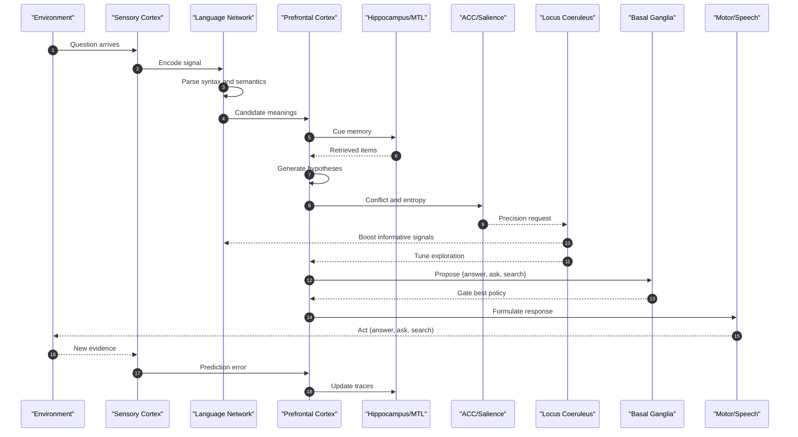

## Brain reasoning flow

```mermaid
sequenceDiagram
autonumber
participant Env as "Environment"
participant SC as "Sensory Cortex"
participant LN as "Language Network"
participant PFC as "Prefrontal Cortex"
participant MTL as "Hippocampus/MTL"
participant ACC as "ACC/Salience"
participant LC as "Locus Coeruleus"
participant BG as "Basal Ganglia"
participant MS as "Motor/Speech"

Env->>SC: Question arrives
SC->>LN: Encode signal
LN->>LN: Parse syntax and semantics
LN->>PFC: Candidate meanings
PFC->>MTL: Cue memory
MTL-->>PFC: Retrieved items
PFC->>PFC: Generate hypotheses
PFC->>ACC: Conflict and entropy
ACC-->>LC: Precision request
LC-->>LN: Boost informative signals
LC-->>PFC: Tune exploration
PFC->>BG: Propose {answer, ask, search}
BG-->>PFC: Gate best policy
PFC->>MS: Formulate response
MS-->>Env: Act (answer, ask, search)
Env-->>SC: New evidence
SC->>PFC: Prediction error
PFC->>MTL: Update traces
```