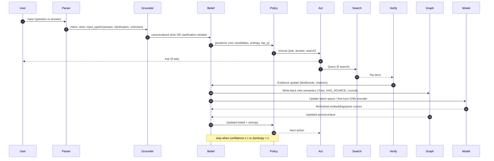

## Simple Architecture Goal Sequence

```mermaid
sequenceDiagram
  autonumber
  participant User
  participant Parser
  participant Grounder
  participant Belief
  participant Policy
  participant Act
  participant Search
  participant Verify
  participant Graph
  participant Model

  User->>Parser: Input (question or answer)
  Parser->>Grounder: intent, slots, input_type∈{answer, clarification, unknown}
  Grounder->>Belief: canonicalized slots OR clarification needed
  Belief->>Policy: {posterior over candidates, entropy, top_p}
  Policy->>Act: choose {ask, answer, search}
  Act-->>User: Ask (if ask)
  Act->>Search: Query (if search)
  Search-->>Verify: Top docs
  Verify->>Belief: Evidence update (likelihoods, citations)
  Belief->>Graph: Write-back new semantics (:Fact, HAS_SOURCE, Lexical)
  Belief->>Model: Update latent space / fine-tune GNN encoder
  Model-->>Belief: Refreshed embeddings/prior scores
  Graph-->>Belief: Updated priors/context
  Belief->>Policy: Updated belief + entropy
  Policy-->>Act: Next action
  Note over Belief,Policy: stop when confidence ≥ τ or Δentropy < ε
```

