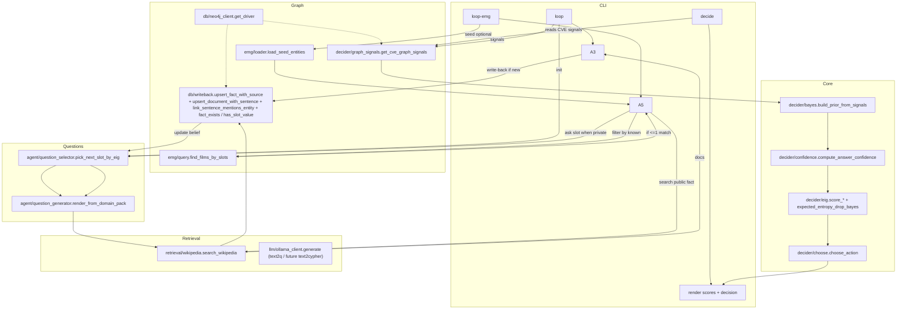

# VEGETA Detailed Process Flow

This diagram shows how the system runs end-to-end, including the active loop, what each function does, and how modules interact.

Legend:
- **decide**: one-shot scoring (no loop). Uses confidence + EIG to choose Answer/Ask/Search.
- **loop**: uncertainty → question → search → write-back; repeats until early stop.
- **loop-emg**: movie episodes (identify_film / retrieve_award). Filters by known slots, asks unknown, searches once, writes back provenance.
- **Private vs public slots**: private → Ask only; public → Search.
