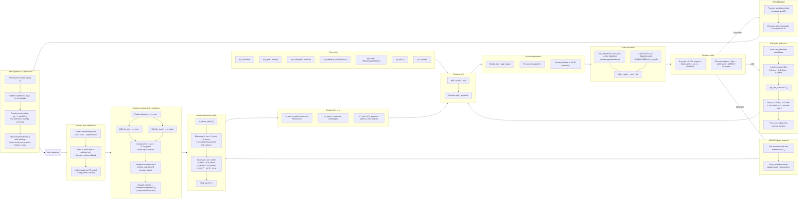

```mermaid
flowchart LR
%% Bayesian Active Inference Decider (condensed but faithful)
%% Orientation
  %% style globals kept default for portability

  Start("User utterance")

  subgraph A["Process user utterance u"]
    A1["Extract entities/keywords<br/>LLM JSON → fallback rules"]
    A2["Build u_terms (set + optional vec)<br/>Jaccard / cosine fallback"]
    A3["Link to graph via FT search<br/>:Entity(name, aliases)"]
    A1 --> A2 --> A3
  end

  subgraph B["Selective activation & candidates"]
    B1["Embed utterance → u_sem"]
    B2["kNN idx_sem → s_sem"]
    B3["kNN idx_graph → s_graph"]
    B4["Combine 0.7·z_sem + 0.3·z_graph<br/>Rank top-K anchors"]
    B5["Neighborhood signature<br/>pooled node emb ⊕ structure sketch"]
    B6["Expand anchors → candidate subgraphs S_j<br/>(2-hop or PPR variants)"]
    B1 --> B2 --> B4
    B1 --> B3 --> B4
    B4 --> B5 --> B6
  end

  subgraph C["Likelihood scoring p(u|v)"]
    C1["u_struct_obs(S_j)"]
    C2["Distances δ_sem, δ_struct, δ_terms<br/>+ penalties (missing slot, hub, detour)"]
    C3["log p(u|v) = -[α·δ_sem/σ_sem² + β·δ_struct/σ_struct² + γ·δ_terms/σ_terms² + pen] + const"]
    C4["Keep top-M S_j"]
    C1 --> C2 --> C3 --> C4
  end

  subgraph D["Priors p(v)"]
    D1["p(z_checklist)"]
    D2["p(z_goal | history)"]
    D3["p(z_subgraph | anchors)"]
    D4["p(z_dialogue_act | history,u)"]
    D5["p(z_step | checklist,goal,history)"]
    D6["p(z_slot_r)"]
    D7["p(z_novelty)"]
  end

  subgraph E["Predict g(v) → u′"]
    E1["u′_sem = pooled node emb ⊕ structure"]
    E2["u′_struct = expected slots/edges"]
    E3["u′_terms ≤ N_expected (names, rels, lexicon)"]
  end

  subgraph F["Posterior q(v)"]
    F1["q(v) ∝ p(u|v) · p(v)"]
    F2["Softmax with τ_posterior"]
    F1 --> F2
  end

  subgraph G["Uncertainty metrics"]
    G1["H[q(v)], top1−top2 margin"]
    G2["Per-slot entropies H_r"]
    G3["Novelty inflates σ² (OOD heuristics)"]
  end

  subgraph H["Action valuation"]
    H1["EIG_ANSWER / EIG_ASK / EIG_SEARCH<br/>(cheap approximations)"]
    H2["Costs: ASK=0.10, SEARCH=0.20<br/>Risk(ANSWER)=(1−q_top1)"]
    H3["Utility = gain − cost − risk"]
    H1 --> H3
    H2 --> H3
  end

  subgraph I["Decision policy"]
    I1["If q_top1 ≥ 0.70 & margin ≥ 0.20 & all H_r < 0.5 → ANSWER"]
    I2["Else pick argmax Utility → {ASK slot r*, SEARCH local/web}"]
  end

  subgraph J["ASK path: pick slot r*"]
    J1["Build slot_table from candidates"]
    J2["Local score per filler<br/>0.5·prov + 0.3·close + 0.2·term"]
    J3["q(z_slot_r) across S_j"]
    J4["score_r ≈ a1·H_r + a2·split + a3·conflict + a4·unknown − cost_r"]
    J5["Tiny LLM outputs one concise question"]
    J1 --> J2 --> J3 --> J4 --> J5
  end

  subgraph K["SEARCH path: targeted"]
    K1["Pick discriminative fact between top S_j"]
    K2["Query reliable sources<br/>update graph + provenance"]
    K1 --> K2
  end

  subgraph L["ANSWER path"]
    L1["Posterior predictive check<br/>(residuals small?)"]
    L2["Respond; else downgrade to ASK/SEARCH"]
    L1 --> L2
  end

  subgraph M["Learn • persist • carry forward"]
    M1["Provenance & retrieval log R"]
    M2["Update calibration: α,β,γ, σ², thresholds"]
    M3["Persist session state: q(z_*), top-M S_j,<br/>slot posteriors, novelty, summary"]
    M4["Next-turn priors from b_t with inertia ρ;<br/>floors & soft resets; short-horizon z_plan"]
    M1 --> M2 --> M3 --> M4
  end

  %% Top-level flow
  Start --> A --> B --> C
  C --> E
  D --> F
  E --> F
  F --> G --> H --> I
  I -->|ANSWER| L
  I -->|ASK| J
  I -->|SEARCH| K
  J --> F
  K --> C
  L --> M --> Start

%% Handy defaults (not rendered as nodes): K=10, M=20, hops=2 or PPR≈50; τ_retrieval=0.7; τ_posterior=0.7;
%% α=1.0, β=0.5, γ=0.3; σ_sem²=0.3, σ_struct²=0.2, σ_terms²=0.2; N_terms_max=15; N_expected=20; λ_missing=0.30; d_cap=40; λ_hub=0.02
```
